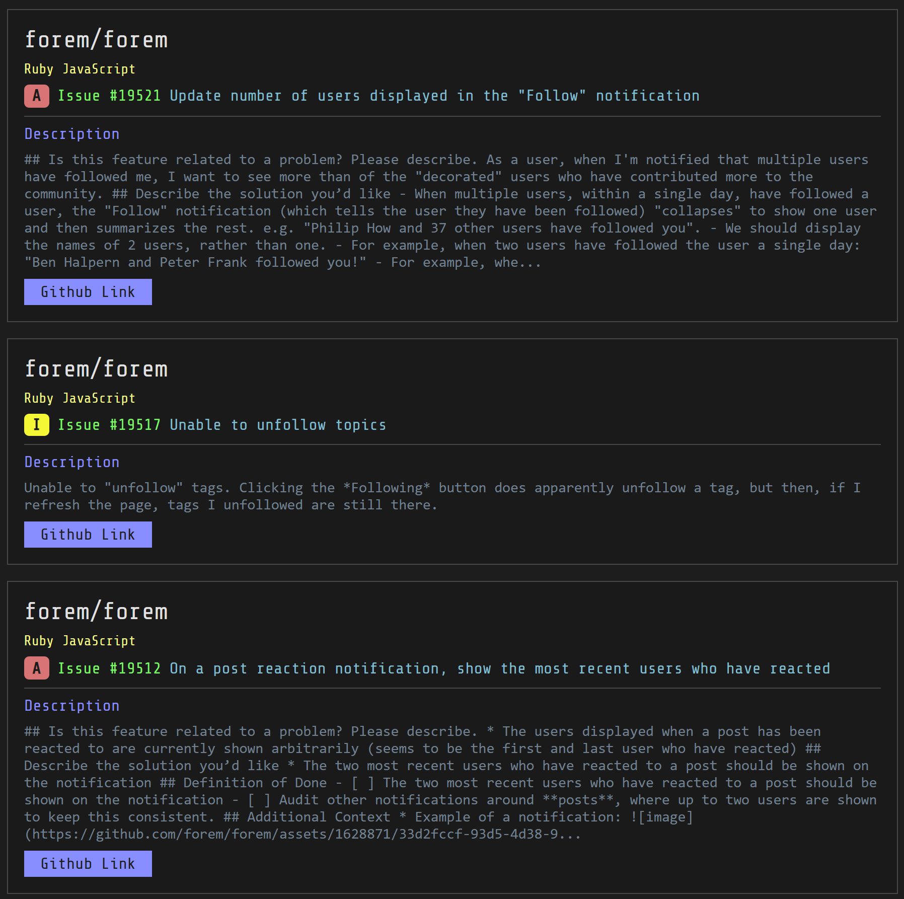

# Got Issues

## About

**This is still a work in progress... and probably will be for awhile 😁**

The main goal of this project was to make it easy to show people that you are looking for help with your project or just want to share it with others. I wanted it to be as simple as adding a workflow file to your repo and then when you created an issue and labeled it with "Help Wanted" it would automatically add your issue to the site.

It was created as part of the [dev.to 2023 Hackathon](https://dev.to/devteam/announcing-the-github-dev-2023-hackathon-4ocn).

## Setup

This is a Next.js project that uses Prisma. To run it you will have to set the environment variable **DATABASE_URL** and point it at your database.
